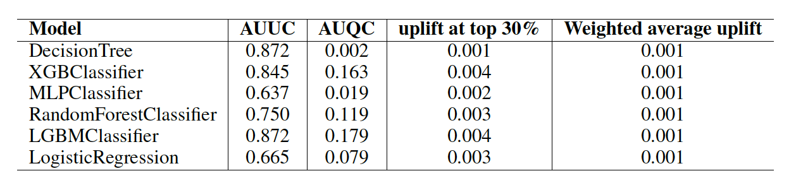
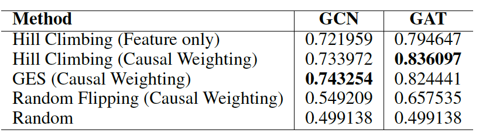

# Uplift Modeling in Online Advertising

## Introduction
We perform analysis and improvements on Uplift Modeling in Online Advertising. We compare different uplift modeling methods from meta-learning approaches (S-learner and T-learner) using various classifiers, and graph ML methods using GCN/GAT based on a discovered causal graph (modified from [this repository](https://github.com/xy2119/Causal_Knowledge_GNN)). Additionally, we propose an alternative causal graph discovery method which enhances performance (measured by AUUC) for graph ML methods.

## Dataset

We utilize the Criteo Uplift Prediction Dataset ([available here](https://ailab.criteo.com/criteo-uplift-prediction-dataset/)). To expedite experiments, we use 10% of the data for analysis.

## Approaches
- We evaluate results using AUUC and AUQC scores as metrics to compare the effectiveness of all approaches.
- T-learners generally perform better than S-learners, and we focus on analysis using tree-based classifiers. Notably, tree-based classifiers generally outperform simpler neural networks or logistic regression models, with the LGBMClassifier achieving the best overall AUUC and AUQC scores.

- For graph ML methods, we concentrate on causal graph discovery methods. Results indicate that the GES method enhances performance compared to other discovery methods. Introducing noise through random edge flipping considerably degrades performance, underscoring the critical importance of accurate causal graph discovery.

- For more detailed findings, refer to our [Project Report](./reports/Project%20Report.pdf).

## How to Use

1) We provide a notebook to run the analysis for meta learners: [Meta Learners Notebook](./notebooks/meta-learners.ipynb).
2) The code for graph ML methods using GCN/GAT is found here: [Graph Learning](./notebooks/graph-learning/). We have modified the code from [this source](https://github.com/xy2119/Causal_Knowledge_GNN) for our analysis.
3) Running the analysis on Google Colab is recommended.

## Citation

- Haowen Wang, Xinyan Ye, Yangze Zhou, Zhiyi Zhang, L. Zhang, and Jing Jiang. 2023. "Uplift Modeling Based on Graph Neural Network Combined with Causal Knowledge." ArXiv.
